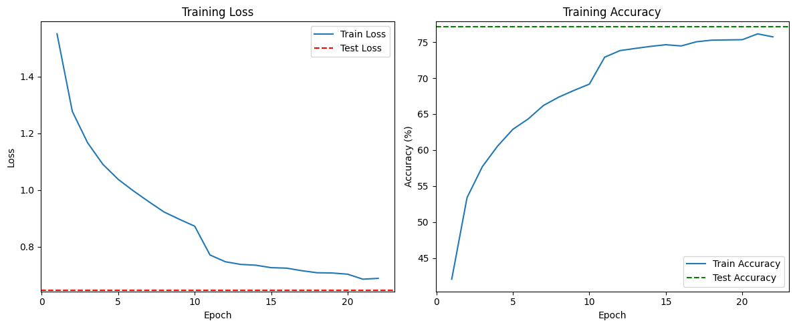
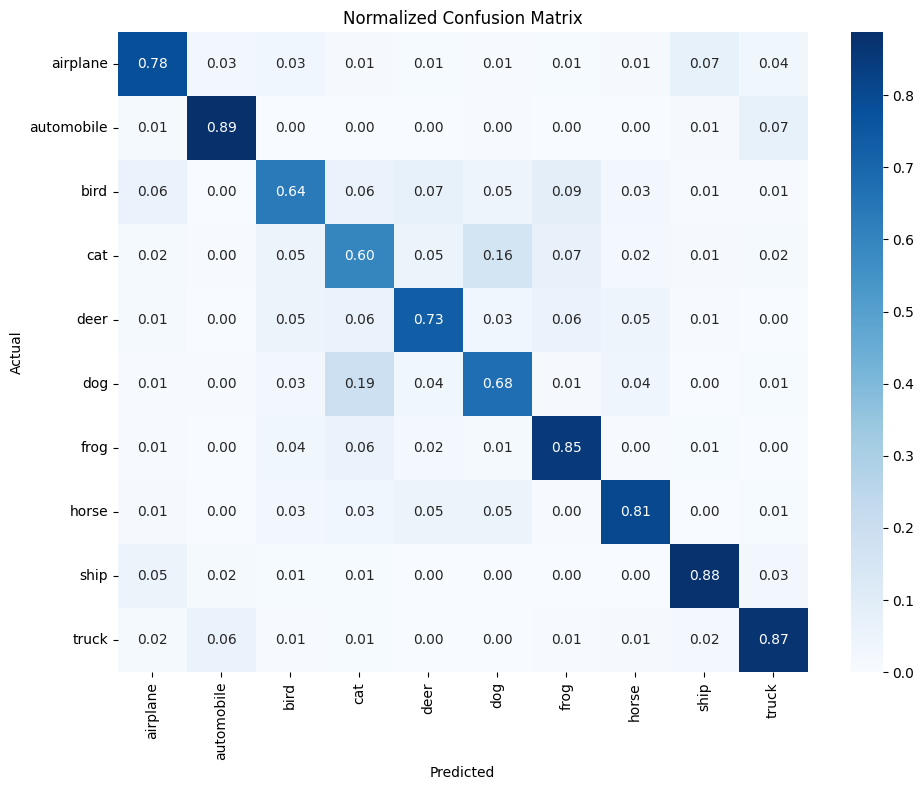
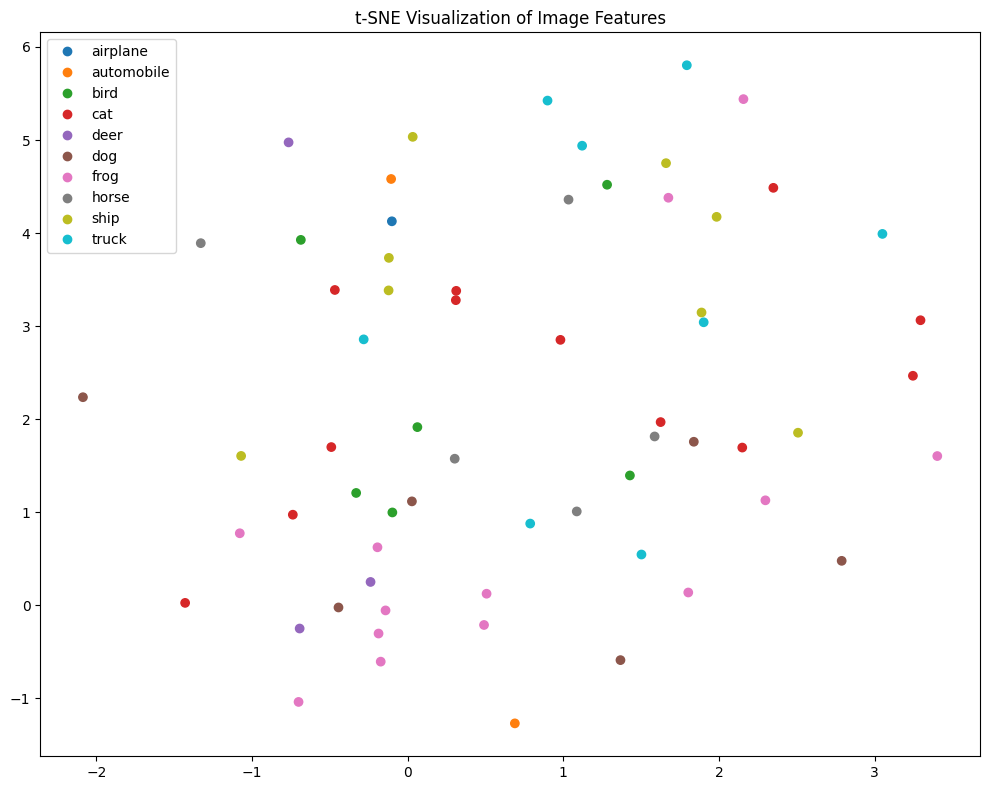
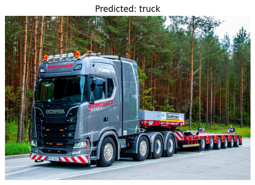
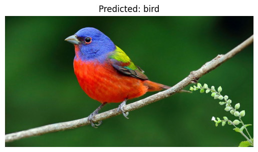
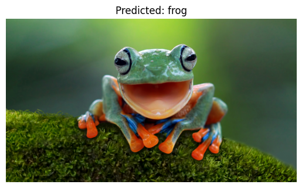

# 🧠 Building a PyTorch-based Image Classifier from Scratch

This project demonstrates how to build a complete image classification pipeline using **PyTorch** and the **CIFAR-10 dataset**. It covers dataset preparation, data augmentation, visualization, model building, training, evaluation, and predicting custom images.

---

## 🧐 Overview

This project walks through the process of building a deep learning image classifier from scratch using PyTorch. It includes:

- Loading and preprocessing data
- Data visualization and exploratory analysis
- Designing and training a CNN
- Evaluating model performance with metrics and visualizations
- Predicting classes for new, unseen images

---

## 📂 Dataset

We use the [CIFAR-10 dataset](https://www.cs.toronto.edu/~kriz/cifar.html), which contains 60,000 32x32 RGB images across 10 categories:

```

airplane, automobile, bird, cat, deer, dog, frog, horse, ship, truck

```

- Training images: 50,000  
- Test images: 10,000  

### 🔄 Data Augmentation

- `RandomHorizontalFlip`
- `RandomRotation`
- `Normalization`

---

## 🧠 Model Architecture

The CNN architecture is composed of:

```

Conv2D(3→32) → BatchNorm → ReLU → MaxPool
→ Conv2D(32→64) → BatchNorm → ReLU → MaxPool
→ Conv2D(64→128) → BatchNorm → ReLU → MaxPool
→ Global Average Pooling
→ Fully Connected (128→512) → Dropout
→ Fully Connected (512→10)

````

- **Activation:** ReLU  
- **Regularization:** BatchNorm + Dropout  
- **Loss Function:** CrossEntropyLoss  
- **Optimizer:** Adam  
- **Learning Rate Scheduler:** StepLR

---

## 🌟 Features

- 📊 Class distribution (Bar chart + Pie chart)
- 🖼️ Sample image display
- 🔍 t-SNE for feature visualization
- 📈 Correlation heatmap of pixel values
- 🧠 CNN from scratch with dropout and batch norm
- 📉 Training loss and accuracy curves
- 📋 Confusion matrix + Classification report
- 🧪 Predictions on custom `.jpg` images

---

## ⚙️ Installation

### 1️⃣ Clone the repository

```bash
git clone https://github.com/JV-Vigneesh/PyTorch-based-Image-Classifier.git
cd PyTorch-based-Image-Classifier
````

### 2️⃣ (Optional) Create a virtual environment

```bash
python -m venv venv
source venv/bin/activate  # On Windows use: venv\Scripts\activate
```

### 3️⃣ Install dependencies

```bash
pip install -r requirements.txt
```

If `requirements.txt` not available, install manually:

```bash
pip install torch torchvision matplotlib seaborn scikit-learn pandas pillow
```

---

## 🚀 Usage

### ▶️ Train & Evaluate the Model

```bash
python main.py
```

This will:

* Train the CNN for 22 epochs
* Print training accuracy and loss per epoch
* Evaluate on the test dataset
* Show confusion matrix and classification report
* Predict custom `.jpg` images

### 🖼️ Predict Custom Images

Place your images (32x32 or will be resized) in the project directory and modify:

```python
image_paths = [
    "t.jpg",
    "p.jpg",
    "b.jpg",
    "f.jpg"
]
```

Predictions and image display will be shown after training.

---

## 📊 Results

### ✅ Final Test Accuracy

* Achieves \~75–80% test accuracy (varies by system and training)

### 📉 Training Curves



### 📁 Confusion Matrix



### 🔍 t-SNE Visualization



---

## 🖼️ Sample Predictions






---

## 📄 License

This project is licensed under the **MIT License**.
See the [LICENSE](LICENSE) file for details.
